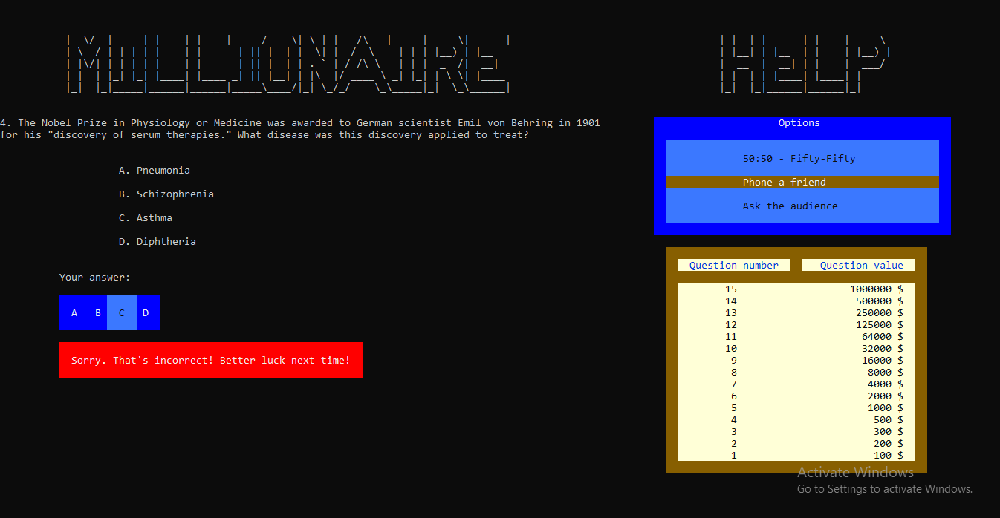
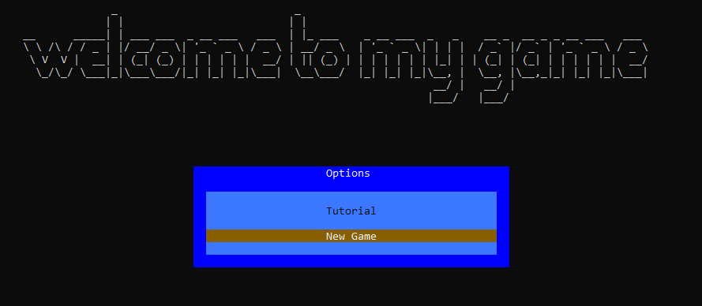
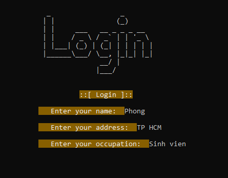
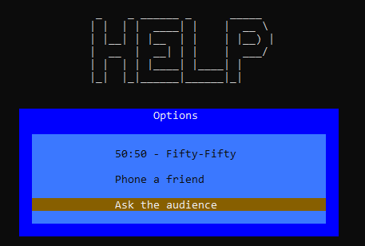
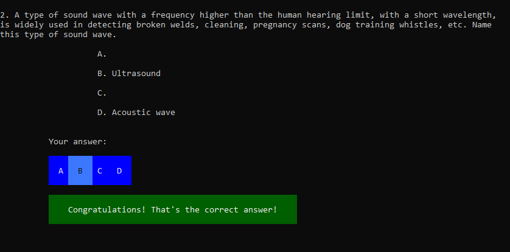
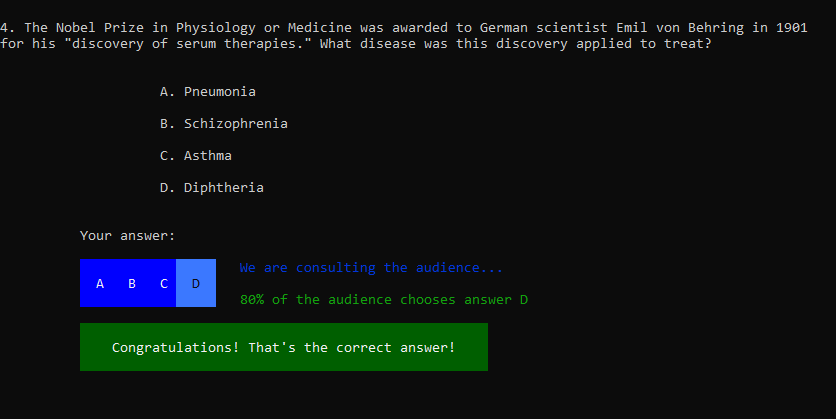
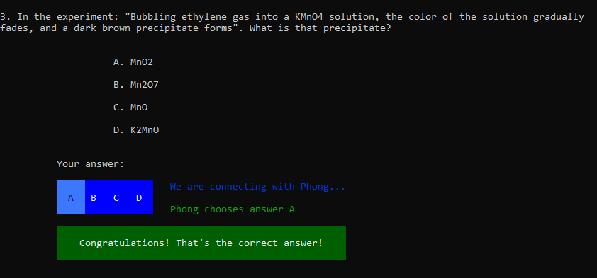
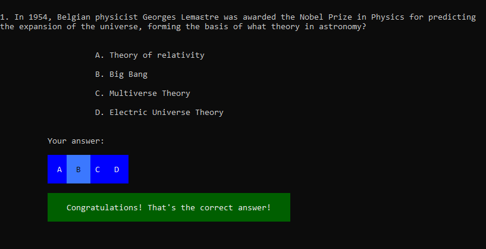
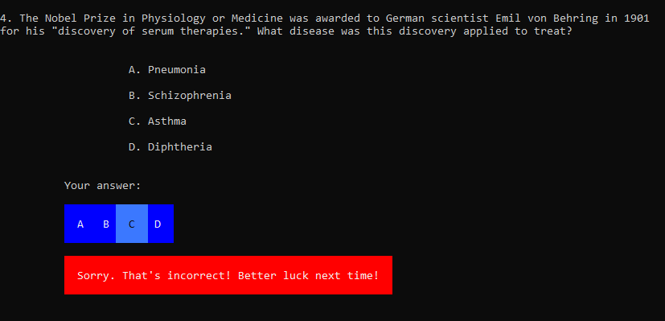

# MILLIONAIRE GAME

# I. INTRODUCTION

## 1. Author

- Full Name: Nguyễn Thanh Phong

## 2. Installation

The game and its code are designed to run natively using ***Visual Studio*** on ***Windows*** platforms, with potential cross-platform compatibility for macOS.  
To experience the game, users should follow these steps:  
- **Step 1**: Download the source code to your computer.  
- **Step 2**: Extract the `millionaireGame.zip` file and open the `millionaireGame.sln` file.  
- **Step 3**: Build and run the program to start playing.

> ***Notes:***  
> - As the program is divided into multiple files, it may take some time to build and run.  
> - Players may need to adjust their input method to ensure accurate key inputs.  
> - Upon starting the game, the console window will be enlarged for a clear and visually appealing interface.

## 3. Game Rules

In this game, players aim to correctly answer a series of multiple-choice questions to win increasing cash prizes, with the ultimate goal of securing the top prize of one million dollars. Players can use lifelines to assist with difficult questions.

  

## 4. Built With

- Tool: Visual Studio 2022
- Language: C++
- Operating System: Windows 10

# II. PROJECT DETAILS

## 1. Project Directory

The ***millionaireGame*** directory contains the `README.md` file, a folder with illustrative images for the project, the main source code, and the `millionaireGame.sln` file to open the entire project.

## 2. Project Source Code

- `README.md`: Contains all project information, installation instructions, program build steps, and additional notes.  
- `functions.h`: Declares the libraries used in the project, defines ***ANSI ESCAPE CODE*** for coloring objects, and builds structures for `gamePlayer` (player) along with functions related to player management.  
- The ***millionaireGame*** directory contains the corresponding `.cpp` source files for each function and the text file `questions.txt` to store the question bank used in the game.

## 3. Game Interfaces

- ***Main*** screen with color effects:

  

> Color effects and transitions between screens are included.

- Upon opening, players are prompted to press ***'Enter'*** to navigate to the main menu.

> ***Notes on selecting menu items***  
- Players use the ***up, down, left, right*** arrow keys (corresponding to ASCII codes ***'72, 80, 75, 77'***) to navigate between menu items and press ***'Enter'*** to select an item.  
- After completing actions in the selected item, press ***'Enter'*** again to return to the main screen.

### 3.1. Main Screen

- Displays the main menu where players can start a new game or exit.

  

### 3.2. Login Screen

- Players enter their username to start the game.

  

### 3.3. Game Overview Interface

- Shows the current question, answer options, and available lifelines.

  

### 3.4. Lifeline Options

- Players can select from three lifelines to assist with answering questions.

  

> ***50-50 Lifeline***  
> - The organizers eliminate two incorrect answer options.

  

> ***Phone-a-Friend Lifeline***  
> - The organizers connect the player with a friend for assistance.

  

> ***Ask the Audience Lifeline***  
> - The organizers poll the audience and provide statistics on their chosen answers, which the player can use to make a decision.

  

### 3.5. Correct/Incorrect Answers

- When the player answers correctly, they proceed to the next question.

  

- When the player answers incorrectly, the game ends.

  

## 4. Information Storage

The question bank is stored in the text file `questions.txt` within the ***millionaireGame*** directory, alongside the `.cpp` source files.

# III. APPENDIX

## 1. Libraries Used

- `iostream`: Handles data input and output.  
- `conio.h`: Reads key presses and handles asynchronous data.  
- `iomanip`: Enhances data formatting for clarity and readability.  
- `fstream`: Manages file input and output.  
- `string`: Enables string usage and built-in string functions.  
- `windows.h`: Provides functions specific to the Windows operating system.  
- `mmsystem.h`: Handles audio processing.  
- `chrono`: Manages time calculations.

## 2. References

- https://downloads.khinsider.com/game-soundtracks/album/who-wants-to-be-a-millionaire-the-album  
- https://github.com/TamasPetii/Who-wants-to-be-a-millionaire
